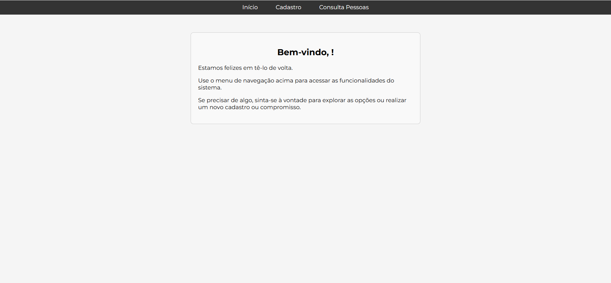
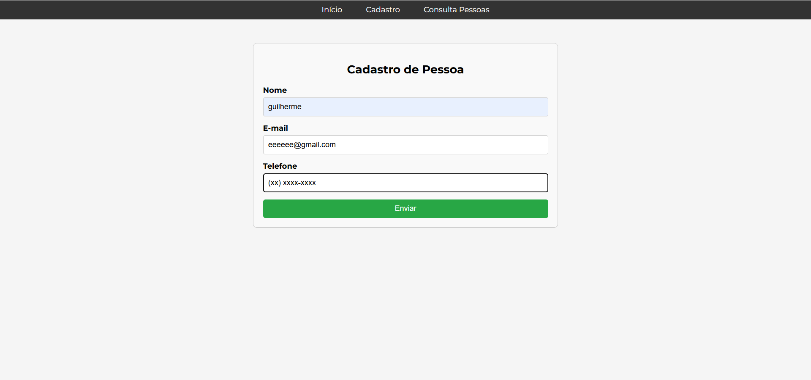
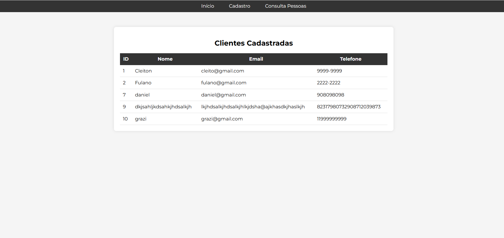

# 👥 Sistema de Cadastro e Consulta de Usuários

Este projeto é um sistema web simples para **cadastro e consulta de usuários**, ideal para fins educativos e de aprendizado com **Flask** e **SQL**. Ele permite adicionar usuários a um banco de dados, visualizar os dados cadastrados e consultar informações específicas com uma interface web amigável.

---

## 🚀 Tecnologias Utilizadas

- **Frontend**:
  - HTML5
  - CSS3

- **Backend**:
  - Python
  - Flask

- **Banco de Dados**:
  - SQLite (ou outro banco relacional via SQL)

---

## ⚙️ Funcionalidades

- Cadastro de novos usuários com nome, email e outros dados
- Consulta de usuários cadastrados em lista
- Pesquisa por nome ou email
- Validação simples de formulários
- Layout responsivo com HTML e CSS

---

